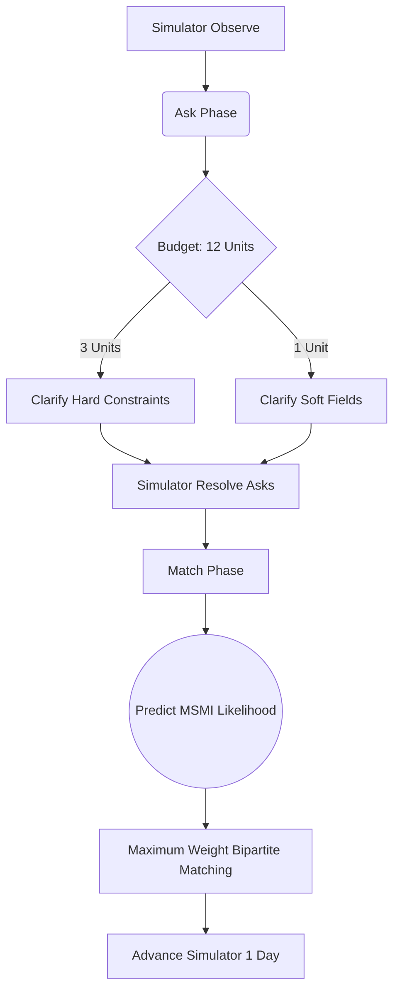

```mermaid
graph TD
    A[Simulator Observe] --> B(Ask Phase)
    B --> C{Budget: 12 Units}
    C -->|3 Units| D[Clarify Hard Constraints]
    C -->|1 Unit| E[Clarify Soft Fields]
    D --> F[Simulator Resolve Asks]
    E --> F
    F --> G[Match Phase]
    G --> H((Predict MSMI Likelihood))
    H --> I[Maximum Weight Bipartite Matching]
    I --> J[Advance Simulator 1 Day]
```
